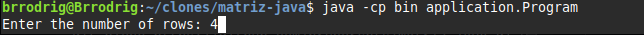
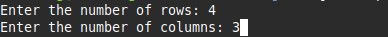
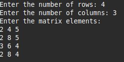
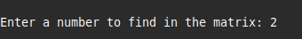
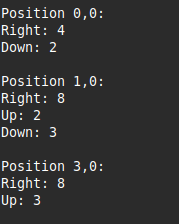

# Desafio Matriz de Vizinhos (Neighbor Matrix Challenge)

## 📄 Descrição

Este é um programa de console em Java desenvolvido como um exercício para praticar a manipulação de arrays bidimensionais (matrizes), lógica de programação e boas práticas de Orientação a Objetos.

O programa solicita ao usuário as dimensões de uma matriz, seus elementos e, em seguida, um número para ser localizado. Para cada ocorrência do número, o programa exibe sua posição e os valores de seus vizinhos adjacentes (acima, abaixo, à esquerda e à direita).

## ✨ Funcionalidades

- Leitura de uma matriz com dimensões `M x N` definidas pelo usuário.
- Localização de todas as ocorrências de um número específico dentro da matriz.
- Exibição da posição (`linha,coluna`) de cada ocorrência encontrada.
- Apresentação dos vizinhos adjacentes (Cima, Baixo, Esquerda, Direita) para cada ocorrência, com tratamento para as bordas da matriz.
- Tratamento de erros para entradas inválidas (não numéricas).

## 🛠️ Tecnologias Utilizadas

- **Java 17+**
- **IntelliJ IDEA** - IDE de Desenvolvimento
- **Git & GitHub** - Controle de Versão

## 🚀 Como Executar o Projeto

Existem duas maneiras de executar este projeto: via terminal (recomendado para entender o processo de compilação) ou diretamente por uma IDE.

### Método 1: Via Terminal (Linha de Comando)

Este método requer que você tenha o **Java Development Kit (JDK)** instalado e configurado nas variáveis de ambiente do seu sistema.

1.  **Clone o repositório** e entre na pasta do projeto:
    ```bash
    git clone https://github.com/brunorsnts/matriz-java.git
    cd matriz-java
    ```

2.  **Compile o código-fonte:**
    Este comando irá compilar todos os arquivos `.java` da pasta `src` e colocar os arquivos `.class` compilados em uma nova pasta chamada `bin`.
    ```bash
    javac -d bin src/application/Program.java src/entities/*.java
    ```

3.  **Execute o programa:**
    Agora, com o projeto compilado, execute o programa. O comando `-cp bin` diz ao Java para procurar as classes na pasta `bin`. Note que precisamos usar o nome completo da classe principal, incluindo seu pacote (`application.Program`).
    ```bash
    java -cp bin application.Program
    ```
4.  **Siga as instruções no console:**
    O programa solicitará que você insira as dimensões da matriz, os seus valores e o número a ser encontrado.

---
### Método 2: Via uma IDE Java (Eclipse, IntelliJ, VS Code, etc.)

Esta é uma maneira mais simples se você prefere usar um ambiente de desenvolvimento integrado.

1.  **Clone o repositório** (se ainda não o fez).
2.  **Abra ou importe o projeto na sua IDE de preferência**:
   - Use a opção "Open Project", "Import Project" ou similar da sua IDE e selecione a pasta do projeto que você clonou.
3.  **Execute a classe principal**:
   - Encontre o arquivo `Program.java` dentro da estrutura do projeto (geralmente em `src/application/Program.java`).
   - Clique com o botão direito sobre ele e escolha a opção para executar o método `main` (algo como "Run As > Java Application" ou "Run 'Program.main()'").

## 🖼️ Demonstração de Uso

Abaixo está um exemplo de como o programa funciona no terminal, passo a passo.

1.  **Primeiro, o programa solicita o número de linhas da matriz:**

    

2.  **Em seguida, o número de colunas:**

    

3.  **Depois, pede os elementos para preencher a matriz, um por um:**

    

4.  **Então, solicita o número que deve ser buscado:**

    

5.  **Finalmente, o programa exibe a posição de cada ocorrência e seus vizinhos:**

    